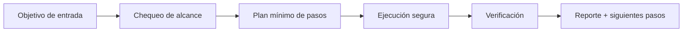

# ⏳ Chrono Ward

<p align="center">
  
</p>

<p align="center">
  <a href="./README.md"></a>
  <a href="./README.es.md"></a>
</p>

<p align="center"><em>⏳ Detección de drift temporal.</em></p>

---

## Resumen
Detector de drift temporal en tareas recurrentes para forzar re-planificación proactiva cuando cambian condiciones, datos o supuestos.

## Arquitectura de entendimiento


## Instalación
```bash
git clone https://github.com/smouj/Chrono-Ward.git
cd Chrono-Ward
cat SKILL.es.md
```

## Uso rápido
```bash
printf "ejecutando chrono-ward...\n"
```

## Estado
- Status: Iniciando
- Dificultad: Media

## Roadmap
- [ ] Implementar lógica core v0
- [ ] Añadir tests de integración
- [ ] Publicar tag estable v1.0.0
