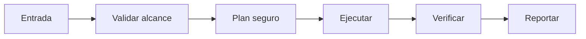

# ⏳ Chrono Ward

<p align="center">
  
</p>

<p align="center">
  <a href="./README.md"></a>
  <a href="./README.es.md"></a>
</p>

## Resumen
Guardián temporal: detecta drift en tareas repetitivas, fuerza re-planificación proactiva y conserva histórico de cambios.

## Instalación
```bash
git clone https://github.com/smouj/Chrono-Ward.git
cd Chrono-Ward
cat SKILL.es.md
```

## Arquitectura de entendimiento


## Estado
Iniciando

## Dificultad
Media
