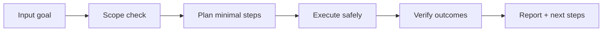

# ⏳ Chrono Ward

<p align="center">
  
</p>

<p align="center">
  <a href="./README.md"></a>
  <a href="./README.es.md"></a>
</p>

<p align="center"><em>⏳ Detección de drift temporal.</em></p>

---

## Overview
Detector de drift temporal en tareas recurrentes para forzar re-planificación proactiva cuando cambian condiciones, datos o supuestos.

## Architecture of understanding


## Installation
```bash
git clone https://github.com/smouj/Chrono-Ward.git
cd Chrono-Ward
# read the contract
cat SKILL.md
```

## Quick usage
```bash
# Example placeholder command
printf "running chrono-ward...\n"
```

## Badges
- Status: Initiating
- Difficulty: Media

## Roadmap
- [ ] Implement core logic v0
- [ ] Add integration tests
- [ ] Publish stable tag v1.0.0
